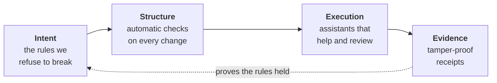
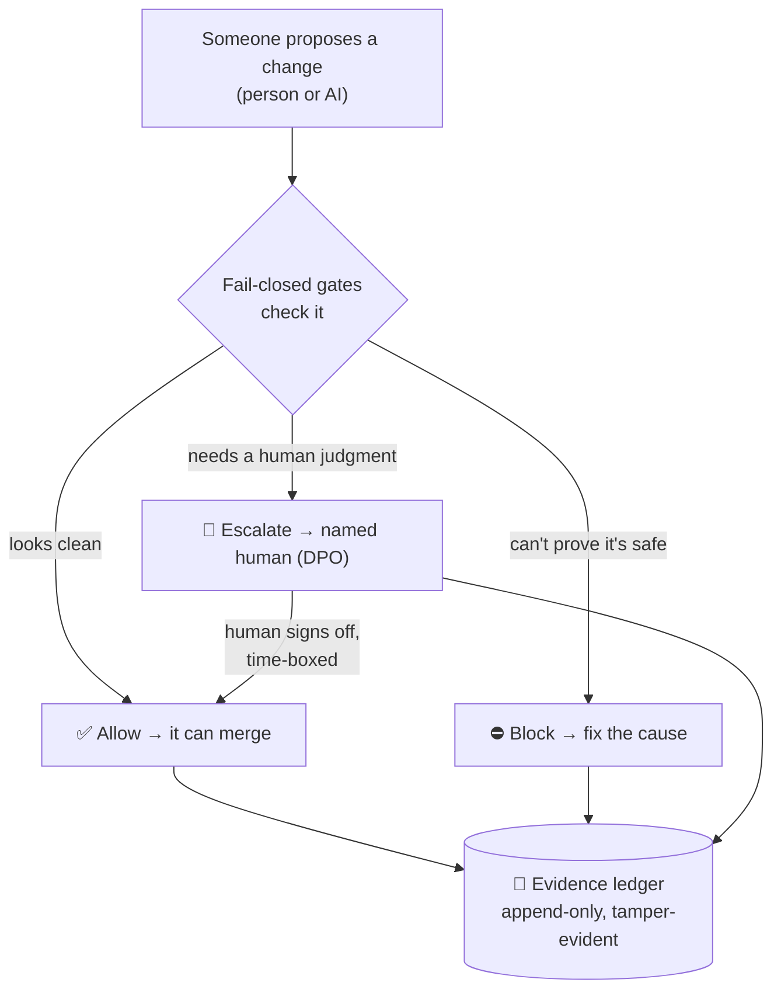
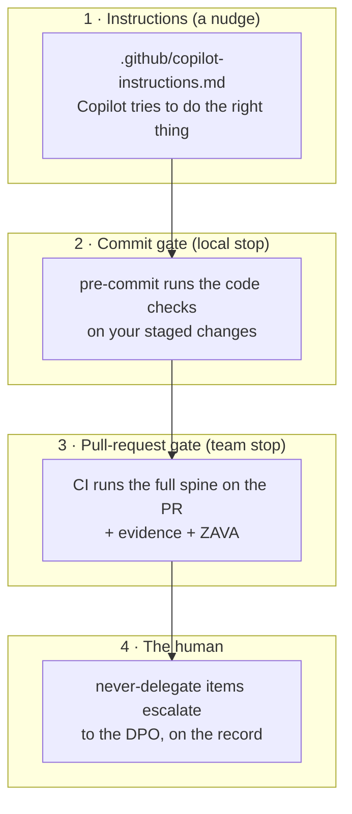

# What we shipped — in plain English

This is the human-language tour of the **compliance spine**. No jargon required. If you want
the design rationale, see [README](./README.md); if you want to run it, see
[GETTING-STARTED](./GETTING-STARTED.md). This page just explains *what it is and why*.

---

## In one sentence

It's a safety rail for AI-assisted software: it automatically checks every change for GDPR
and EU AI Act problems, blocks the risky ones, records what it decided, and pulls in a human
for the calls a machine shouldn't make on its own.

## The problem it solves

AI coding assistants now write, test, and change software faster than any person can review.
When things move that fast, two things quietly break:

1. **Nobody actually decides the compliance-sensitive stuff.** An assistant adds a field that
   stores a customer's data, logs an email address, forgets a deletion rule, or sends data
   abroad — and *no human ever made that decision*. We call that a **ghost decision**: a
   consequential choice with nobody's name on it (and, if it's wrong, a regulator-sized bill).
2. **You can't fix it by "reviewing harder."** More human review just puts the slow bottleneck
   back that the AI removed. And "just trust the AI" is how you get more ghost decisions.

The fix isn't more reviewing or more trust. It's **structure that carries the rules** — a
*spine* the AI works inside, that enforces the non-negotiables automatically and stops to ask
a human at exactly the moments that matter.

## The idea, as a picture

Four parts, in order. Each one feeds the next; the receipts feed back to keep everyone honest.



- **Intent** — a short, ranked list of things we will never let the AI decide on its own
  (e.g. "no personal data in logs"). The constitution. Owned by a human (the DPO).
- **Structure** — the *gates*: small automatic checks, one per rule. They are **fail-closed**
  — if a gate can't *prove* a change is safe, it says no. Silence is not consent.
- **Execution** — four assistants ("agents") that use those gates to guide, test, and review
  the work.
- **Evidence** — every decision is written to an append-only logbook that's chained together
  so tampering is detectable. These are your receipts.

## What actually happens to a change

Someone — a person or an AI assistant — proposes a change. Here's the whole flow:



Three outcomes, never a silent pass:
- **Allow** — the change is clean; it proceeds, and the "allow" is recorded.
- **Block** — the change can't be shown to be safe; it's stopped with a plain-English reason.
- **Escalate** — it's a judgment call (a "never-delegate" item); a **named human** decides,
  and their sign-off is recorded. The AI is never allowed to approve these itself.

A human can also **override** a block — but only deliberately, co-signed, time-limited, and
written into the ledger. No quiet bypasses.

## The pieces we built

### The 10 gates (the automatic checks)

| Gate | In plain English |
|---|---|
| **no-pii-in-logs** | Don't write people's personal data into logs or traces. |
| **lawful-basis-required** | Don't process personal data without stating why you're allowed to. |
| **special-category** | Extra-sensitive data (health, etc.) needs a legal condition + a DPIA. |
| **retention-ttl** | If you store personal data, say how long you keep it and how it's deleted. |
| **cross-border-transfer** | Don't send personal data to another country without a legal mechanism. |
| **encryption-required** | No passwords/keys hardcoded in the code; encrypt stored personal data. |
| **automated-decision** | A computer making a life-affecting decision needs a human path + an explanation. |
| **ai-act-risk-tier** | Classify AI features by risk; if you haven't, treat them as high-risk. |
| **pii-access-boundary** | Keep the analytics/reporting/logging parts of the app away from raw personal data. |
| **model-governance** | Don't ship a model/AI change without proof it was validated, documented, and versioned. |

Some gates read the **code itself** (the top ones — PII in logs, hardcoded secrets, which
component touches personal data). Others check the **context you declare** about a change
(its lawful basis, retention, and so on) — because you can't read "the legal basis is a
contract" out of source code; someone has to state it.

### The 4 assistants (agents)

| Agent | What it does for you |
|---|---|
| **coding-advisor** | Looks at a change and tells you, in plain terms, exactly what to fix. |
| **test-author** | Suggests the compliance tests your change should carry. |
| **quality-reviewer** | Gives a verdict — approve / changes-needed / needs-a-human — and records it. |
| **ai-act-baseline** | For AI features, produces the EU AI Act obligations checklist. |

They make no guesses of their own — they run the same gates, so they can't disagree with the
enforcement. Crucially, the reviewer **refuses to auto-approve** the never-delegate items; it
sends those to a human.

### The receipts (Evidence)

Every decision becomes one line in an append-only logbook. Each line is cryptographically
**chained** to the one before it, so if anyone edits, deletes, or reorders history, the chain
breaks and `verify` catches it. A separate **ghost-decision detector** scans the logbook for
any consequential decision that has no human owner — the exact thing we set out to prevent.

### The proof that the checks work (ZAVA)

A rail is only as good as the check behind it. **ZAVA** is a 100-example test suite that
feeds the gates known-bad and known-good changes and measures two things: does it **catch all
the violations** (recall) and does it **avoid crying wolf** on clean changes (false positives)?
Today it's at **100% caught, 0% false alarms**, and it runs in CI, so a change that weakens a
gate fails the build.

### The guardrail on ourselves (confidentiality)

This spine was built for a specific customer, and **nothing about them may appear in the repo**.
A leak-guard scans every file and fails if a forbidden term slips in — and, importantly, it
doesn't even store those terms in the repo (that would itself be a leak); the real list lives
outside, supplied at check time.

## How it plugs into real work — three layers

You don't adopt this all at once. It layers, from "gentle nudge" to "hard stop":



- **Instructions** tell GitHub Copilot the rules (works in the CLI, the Copilot App, and VS Code).
- **The commit gate** (a pre-commit hook) stops a leaky change on your own machine, before it
  even lands.
- **The PR gate** (CI) runs the whole spine on every pull request.
- **The human** owns the judgment calls — and now has the receipts to stand behind them.

Instructions alone are just hope; the gates are what make it real; the evidence is what makes
it defensible. Together: the change is compliant *and* provable.

## What it is **not** (honest limits)

- **It is not legal advice, and it does not certify compliance.** It *assists and evidences*
  compliance; a qualified human (DPO / privacy / legal) still signs off.
- **It doesn't read minds.** The context-based gates only work if a change declares its
  context. The code-reading gates catch a specific, useful set of things (personal data in
  logs, hardcoded secrets, risky data access) — not every conceivable violation.
- **It's a starting point, tuned to be extended.** New rule → new gate → new test cases. The
  sector-specific judgment calls stay firmly with the human, by design.

## A 30-second look

```bash
./scripts/demo.sh
```
Watch it list the rules, block a change that logs an email address, allow a clean one, take a
human's co-signed override, show the receipts, verify nothing's been tampered with, prove the
checks work, and — last — block a leaky commit.

## Mini-glossary

- **Gate** — one automatic check that must pass.
- **Fail-closed** — when in doubt, say no. The safe default.
- **Ghost decision** — a consequential choice nobody actually made. The thing we prevent.
- **Never-delegate** — the short list of rules the AI may never decide on its own.
- **Escalate** — hand it to a named human instead of auto-approving.
- **Override** — a human deliberately allowing a blocked thing: signed, time-limited, recorded.
- **Evidence ledger** — the tamper-evident logbook of every decision.
- **ZAVA** — the test suite that checks the checks actually work.
- **DPO** — Data Protection Officer: the human who owns the rules and the sign-offs.
